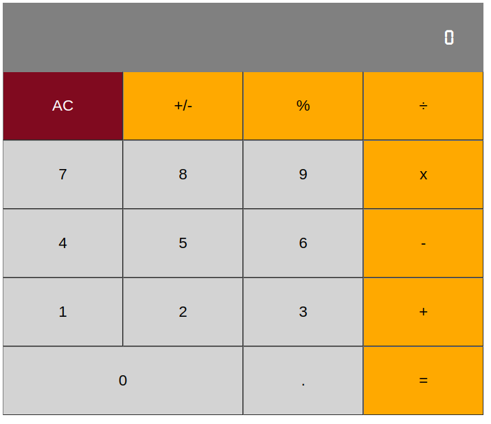

## React Calculator

This project was created as part of the microverse curriculum to practice and learn react.

## Built With

- JavaScript
- React
- HTML
- CSS

This project was bootstrapped with [Create React App](https://github.com/facebook/create-react-app).

## Available Scripts

In the project directory, you can run:

### `yarn start`

Runs the app in the development mode. 
Open [http://localhost:3000](http://localhost:3000) to view it in the browser.

The page will reload if you make edits. 
You will also see any lint errors in the console.

### `yarn build`

Builds the app for production to the `build` folder. 
It correctly bundles React in production mode and optimizes the build for the best performance.

The build is minified and the filenames include the hashes. 
Your app is ready to be deployed!

See the section about [deployment](https://facebook.github.io/create-react-app/docs/deployment) for more information.

## Author

👤 **Miguel Dubois**

- Github: [@MiguelDP4](https://github.com/MiguelDP4)
- Twitter: [@Mike_DP4](https://twitter.com/Mike_DP4)
- LinkedIn [Miguel Dubois](https://www.linkedin.com/in/miguel-angel-dubois)

## Live Demo

You can check a demo version of the project in [this link](https://react-calculator-987465132.herokuapp.com/).

### Demo images

# 🤝 Contributing

This project is for learning purposes only, I wont accept contributions, though suggestions are welcome.

## Show your support

Give a ⭐️ if you like this project!

## Acknowledgments

- I thank microverse for this amazing learning opportunity.
